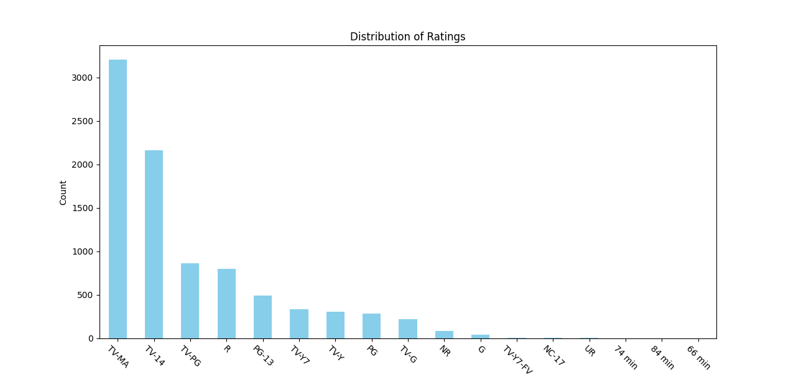
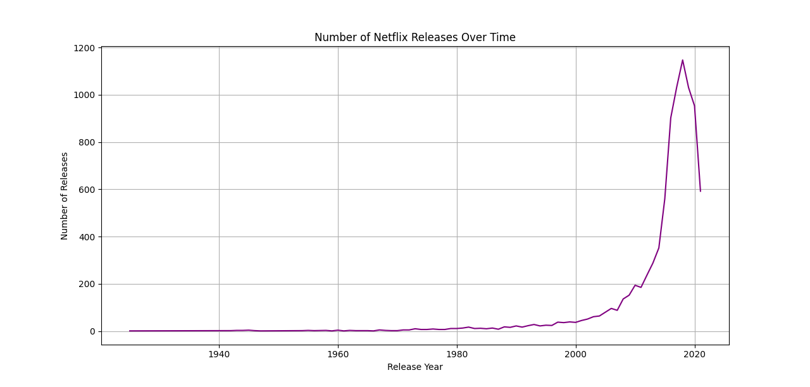
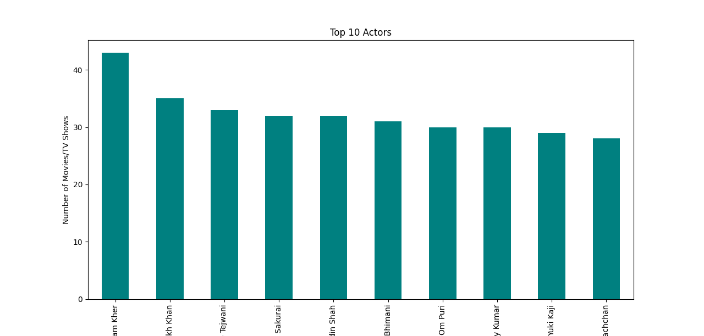

Netflix Data Analysis & Visualization

This repository contains a Python project focused on exploring and visualizing a dataset of Netflix movies and TV shows. Through various analyses and visualizations, the project aims to uncover trends, distributions, and insights into Netflix content.

🎯 Project Objective

Content Distribution: Analyze the distribution of ratings and types of content (Movies vs. TV Shows).

Release Trends: Explore the number of Netflix releases over time.

Actor Analysis: Identify the top 10 actors based on the number of movies or TV shows they have appeared in.

Summary Statistics: Generate a summary table showing the counts and percentages of Movies, TV Shows, and total content.

🧠 Key Insights & Visualizations

Distribution of Ratings: Bar chart visualizing the frequency of each rating.

Content Type Comparison: Bar chart comparing the number of Movies vs. TV Shows.

Release Trends Over Time: Line plot showing the number of releases per year.

Top 10 Actors: Bar chart displaying the top 10 actors based on their Netflix appearances.

Summary Table: Table showing counts and percentages of Movies, TV Shows, and total content.

📊 Sample Visualizations
1. Distribution of Ratings: A bar chart showing the distribution of ratings across the dataset.

2. Distribution of Content Types: A comparison of the number of movies versus TV shows in the dataset.

3. Number of Releases Over Time: A line plot visualizing the trend of Netflix releases by year.

4. Top 10 Actors: A bar chart showing the top 10 actors based on their appearances in Netflix content.

5. Summary Table

A summary of Movies vs. TV Shows in the dataset, including counts and percentages.

